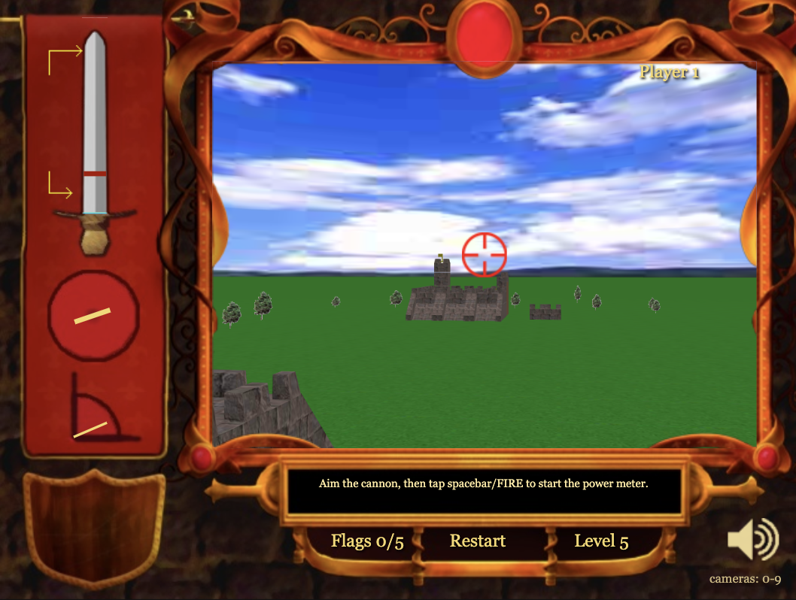
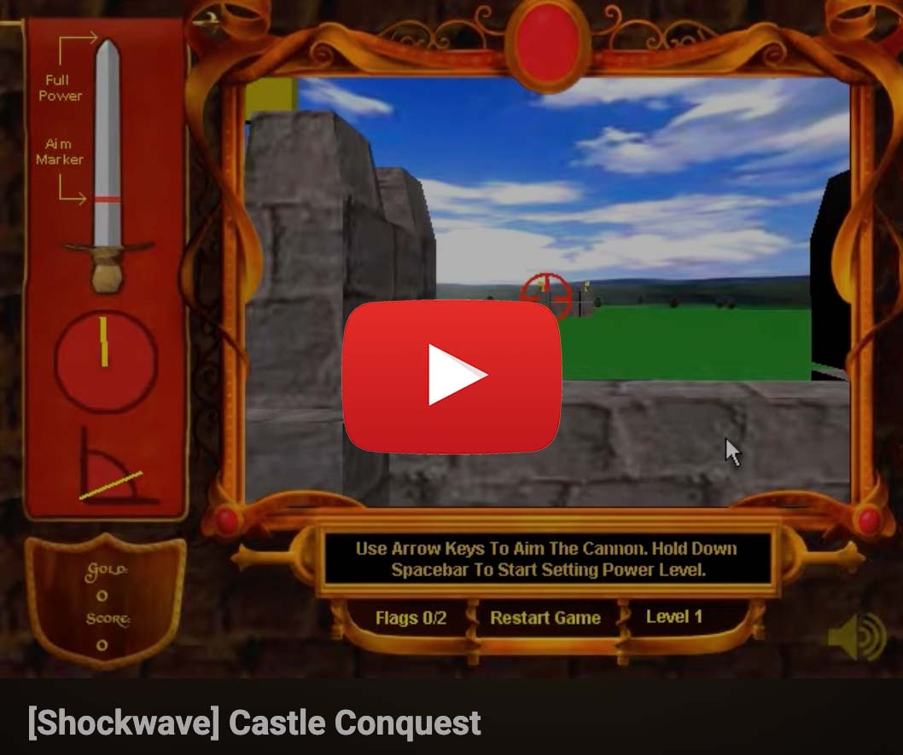
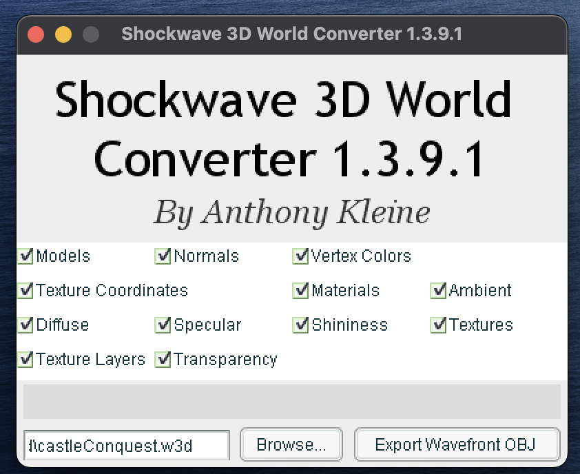
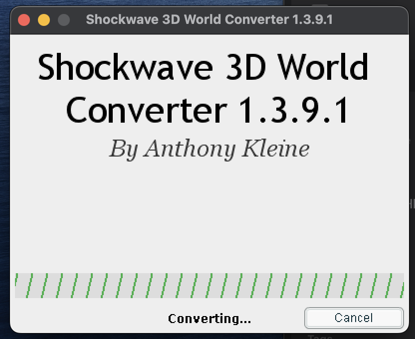

# Castle Conquest Remastered



Play it here: **https://oeponn.github.io/castle-conquest-remastered/**
But before you do, I recommend reading paragraphs two and three at least.

## Why this game

I remember this game on miniclip, or maybe one of the various flash games hosts that would have clones. 2flashgames. Newgrounds?
I have this memory... maybe around 2009, of playing it with my best friend, Anton, at his house on his parents' shitty laptop. His dad yelled at us occasionally to be quiet so he could listen to French radio. We were in New Zealand; he wasn't French, he just fancied himself a linguist. Apparently he also hated the sound of children having fun.


## Rose-tinted glasses

Before you try this out, let's think it through before you destroy your sense of nostalgia derived from a childlike sense of wonder: this was a free 2003 Shockwave
game. The physics were janky even in 2003, the
"3D" is a dozen boxes and cylinders on a grid, and the enemy AI aims at a random
flag and shrugs. If you played this as a kid, your
brain had probably patched over every rough edge with nostalgia, and no
amount of rebuilding it faithfully is going to un-patch that.

I only made this because the flashpoint archive version of it doesn't seem to work at all, even with shockwave downloaded and updated.

I was able to fill some of the gaps in memory by watching this video:

<!-- [](https://www.youtube.com/watch?v=73ZuIfE9_1k) -->
[](https://www.youtube.com/watch?v=73ZuIfE9_1k)

Though, I have a distinct memory of my cannonballs being too slow to do significant damage, and it frustratingly bouncing off the enemy walls lol. I remember following the cannonball pov for ages, and being able to guide it slightly with left/right arrowkeys. Perhaps that video is sped up.

## A physics disclaimer

The original ran on Shockwave's Havok physics plugin, which no longer exists
in any usable form. There's no emulator, no decoder, nothing to point a
modern browser at. Getting the new physics engine (cannon-es) to _feel_ like
the original meant reverse-engineering gravity, launch speed, and impact
behavior from gameplay clues in the decompiled script (an AI aim table, a
smoke-trail duration, a turn timer) rather than from any physics constant
that actually survived. It's close to what I PERSONALLY remember the game felt like, but it is a **reconstruction**, not a bit-for-bit
port. If a shot feels slightly different from how you remember it, it's probably because its been abstracted through 17 years of memory haze.

## Recovering the 3D meshes

The actual 3D castle meshes ship inside Shockwave's `.w3d` files in an Intel
IFX compressed format. Initially I thought these were undecodable, and that any castle geometry would have to be approximated by hand.

Thankfully I was wrong, even though I had already approximated everything by hand. Anthony Kleine's
[Shockwave-3D-World-Converter](https://github.com/tomysshadow/Shockwave-3D-World-Converter)
reads exactly this format. It's a Windows tool, so I ran it using wine, pointed
it at the extracted `castleConquest.w3d`, and exported the whole scene!
Wodels, normals, UVs, materials, textures — straight to Wavefront OBJ. The
recovered geometry and textures are committed in
[`assets/extracted/3d/`](./assets/extracted/3d/) (see commit
[`9848502`](https://github.com/Oeponn/castle-conquest-remastered/commit/9848502db931238852b410805288c5c4806bee4c)). It was like 2am and I was so excited lol.

<p align="center">
  
  &nbsp;
  
</p>

### Getting them into the game

Recovering the OBJ was half of it; the meshes had to replace the
hand-built primitives without breaking a physics engine that was tuned against
those primitives. That whole pipeline lives in commit
[`bc6bfdf`](https://github.com/Oeponn/castle-conquest-remastered/commit/bc6bfdf4d319063bfa72960d53e00022b785dee3):
`tools/convert_3d_models.py` cleans the OBJ, converts the TIFF textures to PNG,
and generates the mesh metadata the game reads at runtime; `models.ts` loads it
once and hands out clones to both the live scene and the castle-select
thumbnails. The game is now **model-1:1 with the original**.

## The technical stuff

The full engineering log; decompiling the game, recovering the physics
constants, fixing the aim math, chasing down deploy failures, is in
[`PORTING_NOTES.md`](./PORTING_NOTES.md). It's written to be read by a human
or by a coding agent, so it's long and blunt
about what was guessed, what was recovered, and what's still approximate.
Highlights if you don't want to read the whole thing:

- The game was Shockwave (Havok 3D), not Flash — decompiled with a patched
  [ProjectorRays](https://github.com/ProjectorRays/ProjectorRays).
- All original art, sound, and Lingo game logic (AI, scoring, castle
  layouts, shop prices) were extracted and ported 1:1.
- The original 3D castle meshes and textures were recovered from the Shockwave
  `.w3d` and are in the game 1:1 — see "Recovering the 3D meshes" above. Only
  the Havok physics engine had to be reconstructed (cannon-es); collision boxes
  are the one geometry approximation that remains.
- Built with Vite + React + TypeScript + Three.js, deployed to GitHub Pages
  via GitHub Actions.

## Changing your gold (a.k.a. cheating)

Progress in this game is just one number: your gold, which unlocks castles
and shop items. It's stored entirely client-side in `localStorage`, under
the key `cstlcnqst20` (the name of the original Flash `SharedObject` this
replaced), as JSON like `{"gold": 1234}`.

If you want more gold, open your browser's DevTools (F12, or
Cmd+Option+I on Mac), go to the Console tab, and run:

```js
localStorage.setItem("cstlcnqst20", JSON.stringify({ gold: 999999 }));
```

Then reload the page.

If you don't already know how to do this: **learn it**. Not because this
particular hack matters. It's a browser game about knocking over toy
castles. But because "open DevTools and poke at the page's stored state"
is a pretty convenient skill. 


At minimum, if you're going to cheat in a game, you should understand
_how_ you're cheating. I was big into hacking for an unfair advantage, so I'm hardly talking from a high horse. I even still write bots for games. But it does kind of take away the sense of achievement, so you may as well get something else out of it.
